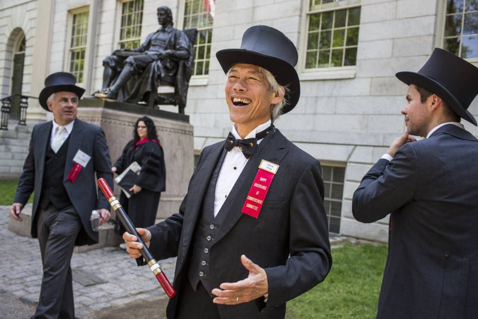

 

 

 

I was asked a number of personal questions in a recent interview.

 

    <b>"How did you get into cryptocurrencies?"</b>

 

In 2013, I was coming off a failed solar power project and I was looking for new business ideas.  I looked at all the new tech fads of the day: drones, 3D printing, artificial intelligence, genomics, robotics etc.  One of my employees, Tim Jundanian, was doing bitcoin mining in his apartment.  It sounded like a printing press of money.  So I asked Tim to set up some rigs in my basement at my home in Harvard Square.  Next to our laundry room, the hardware looked like a Rube Goldberg-like science experiment.   The machines buzzed loudly and emitted a lot of heat, with spaghetti wires going everywhere around the basement.  My wife thought we were going to blow up the house.  When the first electric utility bill came, we were shocked to learn that the monthly bill went from $ 1000 to $ 10,000 for the month !  We had only made $3000 of bitcoin. But when we went to sell the newly minted coins, I noticed that there were many exchanges and the prices were all different.  That’s when the light bulb went off ! Arbitrage ! So I shut down the printing presses, hired Wilson Qin a junior at Harvard majoring in computer science and Eric Zhao, a Columbia grad in statistics and we were off to the races in starting our bitcoin arbitrage fund.   

 

<b>
Why bitcoin and crypto currencies?</b> 
  
 

Because it’s an exotic, off the beaten path new asset class.  I like to build new businesses in emerging industries before the big boys get into it.  I’m not smart enough to be a good equity trader as there are too many talented PhD’s.  But in crypto, there is a lot less competition, or at least that was the case in 2014.  

 

 

Bitcoin trading reminded me of my early days of trading physical uranium between nuclear power plants and uranium mines.  When I told friends of my new activity, they would laugh, joke and accused me of being an arms dealer.  When I told my tennis partner Miles Byrne that I was starting to trade bitcoin, he laughed and joked that I was a drug dealer.   But that was exactly the reaction I was seeking.  I wanted to go into an area where normal people considered the field too risky or too wierd.  As an entrepreneur, I like to go in early into emerging areas where others fear to tread.   Given my limited smarts, I want to get in early and develop a competitive advantage before the smarter people coming into the space.  When they do, it’s time to sell out to them and move onto the next frontier. 

 

<b>
Why arbitrage? </b> 

 

As an investor, I like consistent and steady returns.  Would you rather make 100x your money but along the way suffer a 90% loss?  Or would you rather make 10x but only suffer at maximum loss of 10% along the way?  In hindsight the answer might be 100x.  But without the benefit of the rear view mirror, I would chose the more conservative approach and be able to sleep at night.  For my own family office, capital preservation the primary goal.  So I decided to do arbitrage with crypto currencies rather than a buy and hold, long biased strategy.  In hindsight, I would have been better off buying bitcoin at $100 and holding it.  Today bitcoin is over $10,000 so I would have been up 100x but there have been three 90% drawdowns along the way.  Instead, I’m only up 10x and my maximum loss has been only 10%. 

 

<b>
What is arbitrage?  
</b>

 

It is the simultaneous purchase and sale of the identical asset at different prices.  Our secret mantra (don’t tell my competitors): buy low and sell high.  I learned that at 5 years old when I was sell frogs and toads to my friends.  Arbitrage works well in a very inefficient market.  Back in 2014, we were buying bitcoin in the US and selling it in China for a 10% or greater price.  In 2017, we were buying bitcoin in the US and selling it in Japan and Korea for prices that were at times, 50% higher in price.  We learned that the Asian markets were siloed because retail investors would only read domestic language websites that offered crypto and that it was hard to move their local currency out of the country.  Thus they could only buy crypto in their own country and not in the world markets.  The crypto markets were dominated by retail investors, mostly Korean, Japanese, Chinese stay at home moms or grandmothers speculating in stock markets and now crypto currency markets.  They heard that their neighbor or cousin made a million won, yuan or yen and they too wanted to get rich quick. There was also the Fear of Missing Out.   As a result, the prices of bitcoin in the Asian countries soared in 2017 and showed huge premiums to bitcoin prices in the rest of the world.  We took full advantage.

 

That cross country arbitrage got "arbbed" out by 2018 during the great crypto bear market, as retail investors left in droves.   But new arbitrage opportunities came about.  Spot markets were replaced by derivative markets, e.g. crypto futures.  Then the crypto swap market emerged and presented new arbitrage opportunities between spot, swap and futures markets.  But those arbitrages are getting “arbbed” out today.  We are researching new frontiers in crypto for new arbitrages e.g. crypto options, crypto borrowing and lending, decentralized platforms, are all showing promising signs for new arbitrages.  Our old trading strategies only have shelf lives of 1-2 years so we must do research for the next arbitrage frontiers in order to continue to grow.   I like crypto because there is always something new, e.g. new exchanges, new products, new people, new money, new regulations, new developments which create new arbitrages.  Crypto is a very young and fast growing business and until it matures, I believe we can continuously find new trading opportunities.  

 

<b>
"How did you go from developing power plants to running hedge funds?" </b>

 

 In the first half of my career, I developed solar, hydroelectric and gas fired, cogeneration power plants.   The second half of my career, I have run quant trading hedge funds.   Being a serial entrepreneur, I developed the skill sets of daily business execution, communications, interpersonal relations, marketing, team building, fund raising, risk management and time management.   The content and the connections in the industries are very different, but if you work hard and remain focused, you can learn the new business.  The skills of building a business are transferable across sectors.  

 

 

<b>
"How is your business contributing to society?  How does crypto arbitrage trading making the world a better place?"
</b>

 

I say that we are providing liquidity to the nascent crypto market and liquidity is very important to this new asset class.  We are helping the crypto ecosystem grow and that the dream of crypto to provide financial access to the unbanked and faster-better-cheaper financial products for the world at large.   The dream of the underlying technology blockchain is to provide decentralized services for the world rather than have central institutions control our lives. 

 

The above answer is not good enough for me.   Providing liquidity to markets in crypto, uranium, electricity is not as tangible as building solar and hydroelectric power plants which was my main business before running hedge funds for the past 25 years.  When I was in clean energy, I could say that my activities avoided the burning of millions of tons of fossil fuels which avoided the emissions of millions of tons of carbon into the atmosphere.  My hazard waste disposal business prevented the illicit disposal of millions of pounds of PCBs, a toxic waste, from being released into the environment.  My energy conservation business avoided consumption of billions of BTUs of energy which avoided the release of millions of tons of carbon.  

 

 

To have a more tangible positive impact on society, my family philanthropy is focused on the Harvard Chan School of Public Health where we have endowed a university professorship and scholarships for promising students in public health. I have served on the Visiting Committee and today serve on the Dean’s Council of the School.  I’m passionate about the prevention of disease, such as good nutrition to prevent cardiovascular disease, obesity and diabetes.  I believe that the return on investment in prevention is much higher than the investment in developing cures, although both are needed.  An ounce of prevention is worth a pound of cure. This applies today to the coronavirus pandemic: it’s a much better societal investment to prevent the spread of the virus than it is to invest in cures.  Furthermore, it’s a better investment to prevent the spread of the disease than it is to invest in propping up the stock market.   More on that in a later post.    

 

I also give back to my alma mater.  Harvard invested in me in the past, so today I invest in Harvard students by sponsoring 6 scholarships at The College.   I would not have been able to afford a college education were it not for my forefathers investing in me.  When the cost of college was only $4000, Harvard gave me a $ 2000 grant, $1000 work study and a $1000 annual loan.   In the first 10 years after graduation, every year I wrote to Harvard begging for foregiveness to repay the loan and every year, they let me delay payment.  When I sold my first business in 1986 for $ 4 m, I paid off the loan in one fell swoop.   At my 25th reunion, I donated $5 m to Harvard to endow the professorship and scholarships.   That’s a 300% return on investment to Harvard; but I’m the one who benefitted even more.   So I hope my investment in future students will have even greater returns.  With that I hope that St Peter will let me get into Heaven for having a positive impact on society despite being a lowly arbitrageur.  

 

-MLD

